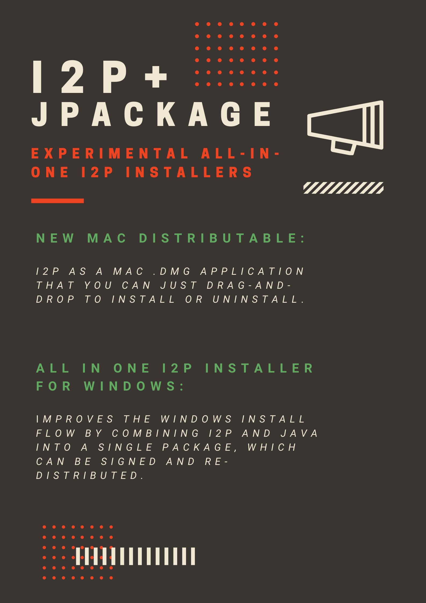

# Experimental Jpackaged I2P Installers

Traditionally, I2P runs using a Java Runtime Environment which exists on
the host machine. This requirement adds a series of "Extra" steps to
install I2P on most platforms. With these installers, I2P comes with a
Java "Runtime Image" created using a tool called `jpackage`. `jpackage`
allows us to collect all the libraries and tools required to run I2P
into a single, consistent package which is easy to install and redistribute. 

## So what does that mean?

It means an easier-to-understand and faster I2P installation process,
which involves less third-party software.

## Why isn't it the default yet?

Well because we haven't decided to yet. Besides that, we need to make sure
that we can update the I2P router it installs at update time correctly,
and a few other little things. You can find out more about development at
the wiki pages below.

**If you choose to install this software you will need to manually update**
**it at least once at a future date. Automatic updates are not available at**
**this time.**

### Wiki Pages:

 - [Windows All-in-One Installer](https://i2pgit.org/i2p-hackers/i2p.firefox/-/wikis/All-in-One-I2P-Installer-for-Windows) Gitlab Wiki on i2pgit.org
 - [Mac OSX .dmg Installer](https://i2pgit.org/i2p-hackers/i2p-jpackage-mac/-/wikis/New-Mac-Distributable) Gitlab Wiki on i2pgit.org

### Windows 10

 - **[Install Firefox First](https://www.mozilla.org/en-US/firefox/windows/)**

If you have Firefox installed on your Windows 10 PC, you can simply
download the Github Release of the All-in-One-Installer.exe below. Double
click the installer and step through the process. Once you're done, I2P
will start and Firefox will launch configured for I2P.

### Mac OSX

If you are using Mac OSX, the .dmg file is a normal Mac application image.
Install it just like any other Mac application.

- [The whole install process on OSX](osx.html)

### Downloads:

 - [Windows All-in-One Installer](https://github.com/eyedeekay/i2p.firefox/releases/tag/v4-0.4-0.9.50) Github Release
 - [Mac OSX .dmg Installer](https://muwire.com/downloads/I2P-0.9.49-10.dmg) Direct Download

### Source Code:

 - [Windows All-in-One Installer](https://i2pgit.org/i2p-hackers/i2p.firefox/) Gitlab Repository on i2pgit.org
 - [Mac OSX .dmg Installer](https://i2pgit.org/i2p-hackers/i2p-jpackage-mac/) Gitlab Repository on i2pgit.org

[Imagery was created by I2P Contributor Sadie](https://i2p.medium.com/workflows-and-experimental-installers-b32ba7255ed5)